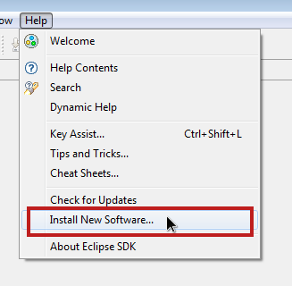
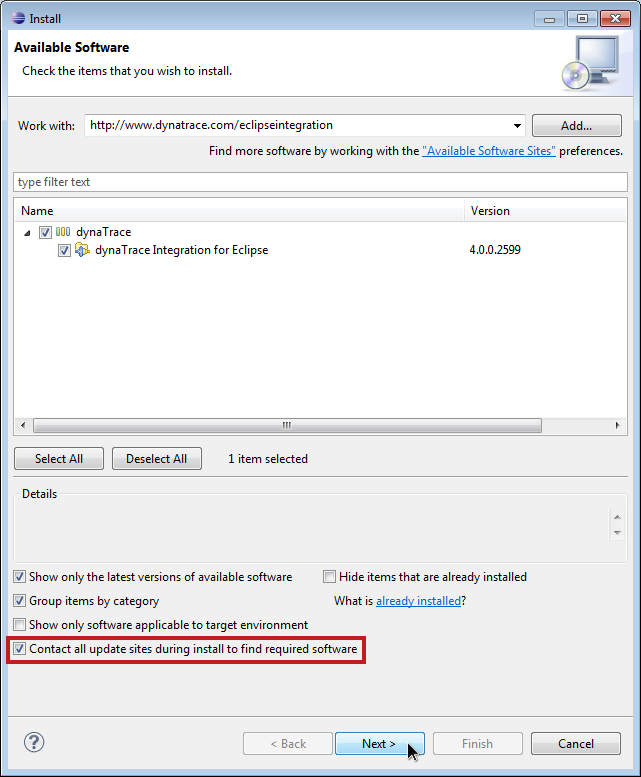
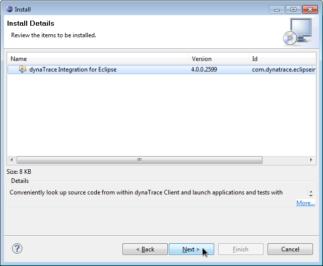
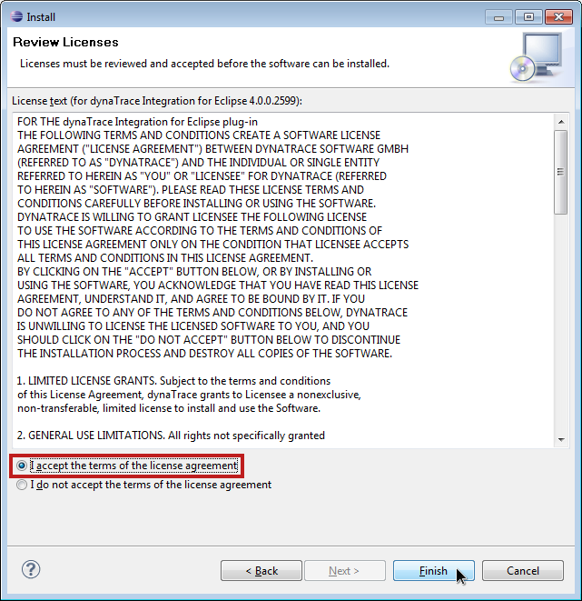
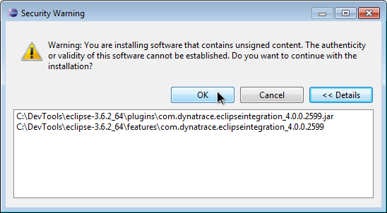
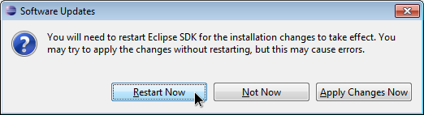

# dynaTrace Eclipse Integration Plugin

| Name | dynaTrace Eclipse Integration Plugin
| :--- | :---
| Description | The dynaTrace Eclipse Integration Plugin replaces the previously existing CodeLink Plugin. It provides a comfortable way to perform look-ups of sources files and methods from applications under diagnosis and also allows to launch applications with an injected dynaTrace Agent directly from Eclipse.
| Version | 3.1.1, 3.5, 4.x, 5.x, 6.0
| Support | [Supported](https://community.compuwareapm.com/display/DL/Support+Levels#SupportLevels-Supported)
| Known Problems | [KB-454 Software Update in Eclipse encounters problem](https://community.compuwareapm.com/community/display/KB/KB-454+Software+Update+in+Eclipse+encounters+problem)
| Supported dynaTrace Versions | 3.1, 3.2, 3.5, 4, 4.1, 4.2, 5, 5.5, 5.6, 6.0
| Supported Eclipse Versions | Eclipse 3.4 with Java JRE 6 or later and installed SDK and Platform SDK packages
| Eclipse Update Site | [http://www.dynatrace.com/eclipseintegration](http://www.dynatrace.com/eclipseintegration)

### Download

** TO CPWR EMPLOYEES  **: When uploading a new version of the plugin also make sure to notify [apmcommunity@compuware.com](mailto:apmcommunity@compuware.com) to upload it to [www.dynatrace.com/eclipseintegration](http://www.dynatrace.com/eclipseintegration). 

Download dynaTrace [com.dynatrace.eclipseintegration_6.0.0.6733.jar](attachments_174751938_1_com.dynatrace.eclipseintegration_6.0.0.6733.jar) Eclipse Integration Plugin for 6.0  
Download dynaTrace[com.dynatrace.eclipseintegration_5.6.0.5713.jar](attachments_150700304_1_com.dynatrace.eclipseintegration_5.6.0.5713.jar) Eclipse Integration Plugin for 5.6  
Download dynaTrace [com.dynatrace.eclipseintegration_5.5.0.5226.jar](attachments_121569594_2_com.dynatrace.eclipseintegration_5.5.0.5226.jar) Eclipse Integration Plugin for 5.5  
Download dynaTrace [com.dynatrace.eclipseintegration_5.0.0.3772.jar](attachments_100925538_1_com.dynatrace.eclipseintegration_5.0.0.3772.jar) Eclipse Integration Plugin for 5  
Download dynaTrace [com.dynatrace.eclipseintegration_4.2.0.3154.jar](attachments_89718916_1_com.dynatrace.eclipseintegration_4.2.0.3154.jar) Eclipse Integration Plugin for 4.2  
Download dynaTrace [com.dynatrace.eclipseintegration_4.1.0.2898.jar](attachments_67829819_1_com.dynatrace.eclipseintegration_4.1.0.2898.jar) Eclipse Integration Plugin for 4 and 4.1  
Download dynaTrace [com.dynatrace.eclipseintegration_3.5.0.2248.jar](attachments_39518955_1_com.dynatrace.eclipseintegration_3.5.0.2248.jar) Eclipse Integration Plugin for 3.5  
Download dynaTrace [com.dynatrace.eclipseintegration_3.1.1.1827.jar](attachments_17563704_1_com.dynatrace.eclipseintegration_3.1.1.1827.jar) Eclipse Integration Plugin for 3.1 and 3.2

To further simplify problem resolution, dynaTrace directly integrates with Eclipse through its dynaTrace Eclipse Integration Plugin. This plugin has two main features:

  * **Launcher**: With the dynaTrace Launcher, instrumenting an application which is developed in Eclipse is now as easy as launching it normally. This further improves the integration of dynaTrace at an early stage of the development lifecycle of a product. 

  * **CodeLink**: Once dynaTrace has identified a certain source code fragment as the root cause of a particular problem, developers can directly jump from the dynaTrace Client to the exact location within their Eclipse development environment where they need to apply the necessary changes. This saves the time and hassle required to switch between dynaTrace and Eclipse then locating the right classes and methods within the source code by replacing it with a single click. 

## Install dynaTrace Eclipse Integration Plugin

The dynaTrace Eclipse Integration Plugin is an extension for [eclipse](http://www.eclipse.org/), so in order to use it you would need to download and setup eclipse on your machine. Please check
[http://www.eclipse.org](http://www.eclipse.org/) for installing eclipse.

### Installation

#### Prerequisites:

The plugin requires that the Eclipse SDK and Platform SDK packages are installed. To install them select "Install new Software" or "Software Updates" (depending on your Eclipse version) from the
"Help" menu, then  
select "Eclipse Project Updates" from the drop down. Check "Eclipse Platform SDK" and "Eclipse SDK" in the list and then install.

There are two methods for installing the dynaTrace Eclipse Integration Plugin:

#### A) Manual installation:

Shut down Eclipse (if it is currently running).  
Remove any Files with filenames that start with "com.dynatrace" from the "dropins" directory of your Eclipse installation, then download the .jar file from the link above and copy it into this
directory.  
Afterwards start Eclipse with the parameter "-clean".

#### B) Download and Install dynaTrace Eclipse Integration Plugin directly via Eclipse

Now, it is easy to setup dynaTrace Eclipse Integration Plugin using the Eclipse update manager, as described in the following steps.

1\. Select the eclipse menu **"Install New Software..."** as shown in the following figure. It will bring up the **"Install"** dialog box.  

2\. Click on **"Add"** button and fill-out information in the **"Add Repository"** dialog box as shown the following figure. Use the URL

    
    
    http://www.dynatrace.com/eclipseintegration

for the current version of the Plug-In. For previous versions of the dynaTrace CodeLink Plug-In visit [our download page](http://www.dynatrace.com/downloads) and follow the manual installation
procedure noted above.

Version matching

The dynaTrace Diagnostics CodeLink version must match the same dynaTrace Diagnostics Client version number to be compatible. E.g. use dynaTrace Diagnostics CodeLink 2.5 with the dynaTrace Diagnostics
2.5.x Client and the dynaTrace Diagnostics CodeLink 2.1 version with the dynaTrace Diagnostics 2.1.x version.

3\. Select _dynaTrace Integration for Eclipse_ and click on **"Next >"** button.

Dependency

Also check **"Contact all update sites during install to find required software"** to install the _Eclipse Platform SDK_ if not already installed in Eclipse.

4\. Click on **"Next >"** button to accept the installation of the presented items.  

5\. Ready and accept the license agreements and click the **"Finish"** button to install _dynaTrace Integration for Eclipse_  

6\. Say **OK** to the warning about unsigned content.  

7\. Restart Eclipse to finish installation.  

## Usage

For detailed user guide please consult the [Eclipse Integration Plugin](https://community/display/DOCDT42/Eclipse+Integration+Plugin)

## Old Versions of this document

Version

Link

CodeLink Plugin 3.0.x

[CodeLink Plugin 3.0.x for Eclipse](https://community/display/DL/CodeLink+Plugin+3.0.x+for+Eclipse)

CodeLink Plugin 2.6.2

[CodeLink Plugin 2.6.2 for Eclipse](CodeLink_Plugin_2.6.2_for_Eclipse.html)

